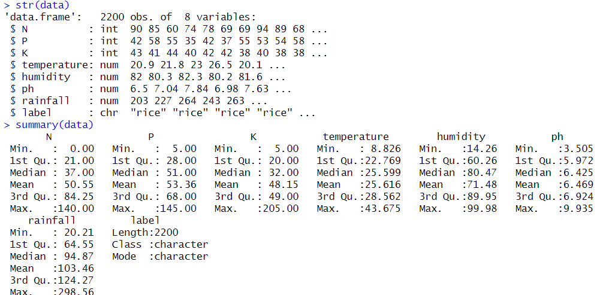
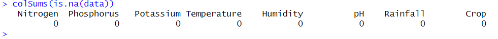
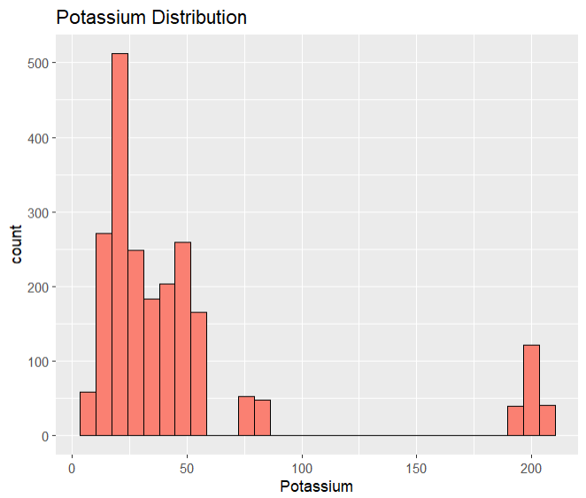
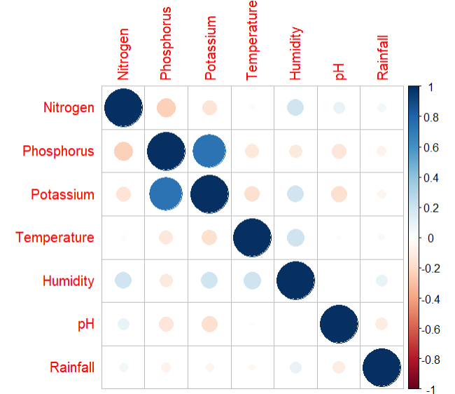
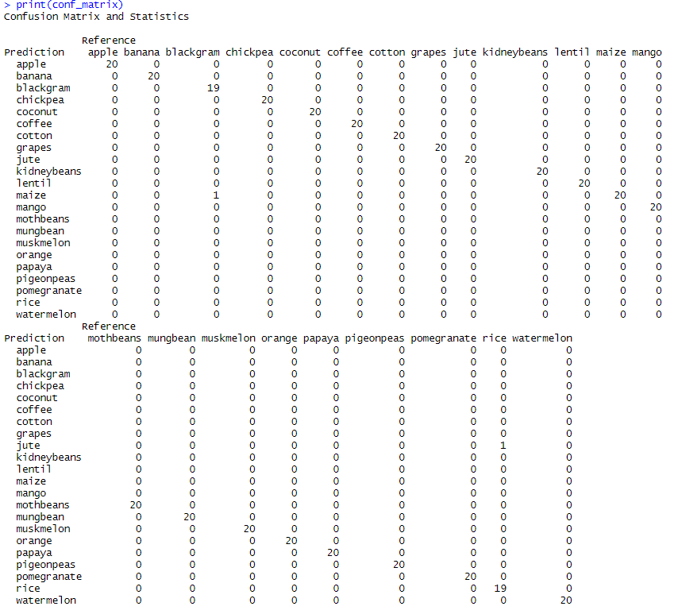
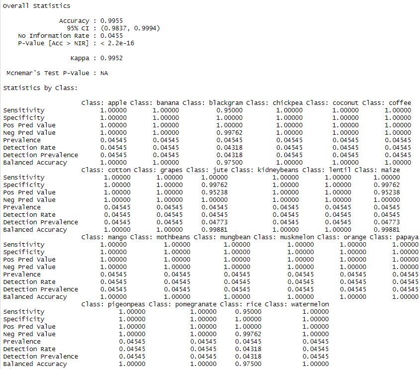
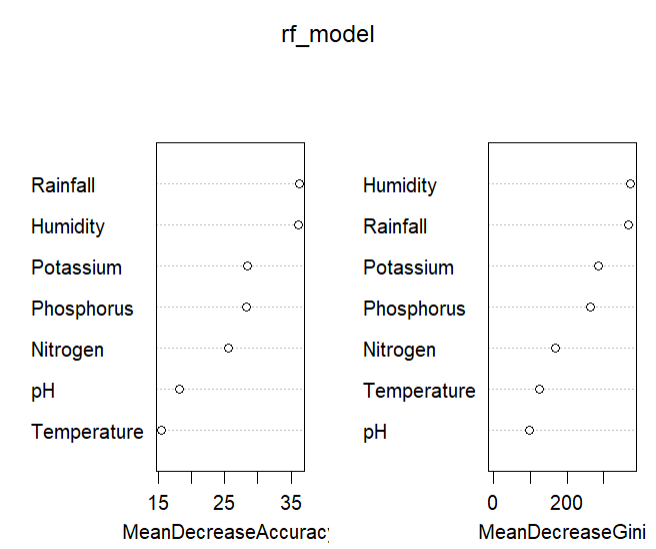
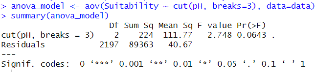
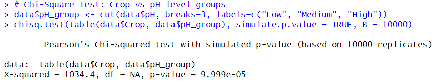

# Soil-Driven Crop Recommendation System

A machine-learning project in **R** that recommends the most suitable crop to grow from seven soil and climate measurements: Nitrogen (N), Phosphorus (P), Potassium (K), temperature, humidity, pH and rainfall. A Random Forest classifier trained on 2,200 field records reaches **99.55% accuracy** across **22 crops**, supporting data-driven, sustainable farming decisions.

> This repository documents the project (description, method, results). The source code lives in a private repository, `Soil-Driven_Crop_Recommendation_System-code`. All screenshots below are real RStudio output.

## Dataset
[Kaggle: Crop Recommendation Dataset](https://www.kaggle.com/datasets/atharvaingle/crop-recommendation-dataset): 2,200 rows, 8 columns, 22 crops with 100 rows each (rice, maize, chickpea, kidney beans, pigeon peas, moth beans, mung bean, black gram, lentil, pomegranate, banana, mango, grapes, watermelon, muskmelon, apple, orange, papaya, coconut, cotton, jute, coffee). No missing values.

## How it works
1. **Load and clean**: read the CSV, rename columns to Nitrogen, Phosphorus, Potassium, Temperature, Humidity, pH, Rainfall, Crop; confirm there are no `NA`s; turn the crop label into a factor.
2. **Explore**: histograms of each nutrient and a correlation matrix. Phosphorus and Potassium are strongly positively correlated (about 0.7); most other pairs are weak, so the features carry mostly independent information.

   | Potassium distribution | Correlation matrix |
   |---|---|
   |  |  |

3. **Model**: split the data 80/20 (`caret::createDataPartition`, seed 123), then train `randomForest` with 100 trees on all seven features (440 test rows, 20 per crop).
4. **Evaluate**: the confusion matrix is almost perfectly diagonal; only two of 440 test rows are misclassified (one black gram predicted as maize, one rice predicted as jute). Accuracy 0.9955 (95% CI 0.9837 to 0.9994), kappa 0.9952.

   

   

5. **Feature importance**: rainfall and humidity matter most, then potassium and phosphorus; pH and temperature matter least.

   

6. **Statistical tests**: a one-way ANOVA of a demonstration "suitability" score across three pH bands (p = 0.064, not significant at 5%) and a chi-square test of crop against pH group (X-squared = 1034.4, simulated p < 0.0001), showing that the crop mix depends strongly on pH.

   | ANOVA | Chi-square |
   |---|---|
   |  |  |

## Using the model
Give the trained forest a row of values, for example N=90, P=42, K=43, temperature 21 C, humidity 82%, pH 6.5, rainfall 203 mm, and it returns the predicted crop (rice for this record in the dataset).

## Tech stack
R, dplyr, ggplot2, caret, randomForest, corrplot.
